# 멀티모달과 단일 CNN 모델의 얼굴 감정 인식 성능 비교 연구
2025.05.12 ~ 2025.06.10

---
## Motivation

기존 CNN 모델은 명확한 감정에는 강점을 가지지만, 복합적이거나 문맥을 요구하는 감정 인식에는 한계가 존재합니다.  
본 프로젝트는 이미지로부터 감정을 설명하는 문장을 생성하는 **Vision-Language Model (VLM)** 을 도입하여 CNN의 한계를 보완합니다.

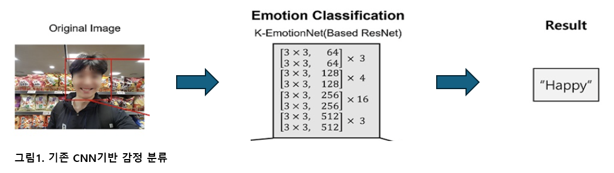
출처: https://www.ki-it.com/_common/do.php?a=full&b=22&bidx=3223&aidx=35957

---

## Related Work

LLaVA-1.5 등 VLM 기반 구조는 이미지 속 인물의 분위기, 상황 등 맥락까지 반영하여 더 정밀한 감정 분석이 가능합니다.

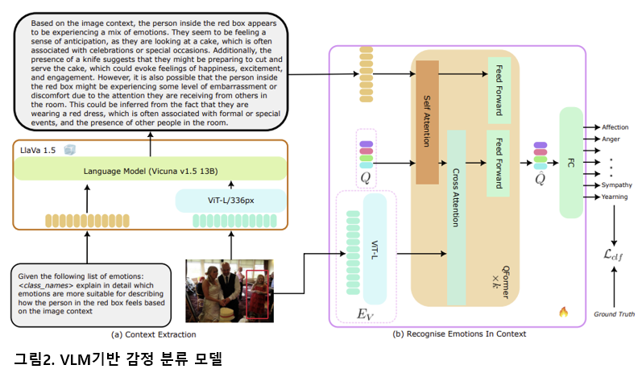

출처:Yang, Z., Zhang, B., & Deng, J. (2024). VLLMs Provide Better Context for Emotion Understanding Through Common Sense Reasoning. arXiv:2404.07078.

---

## 시스템 구성 개요

### 전체 구조

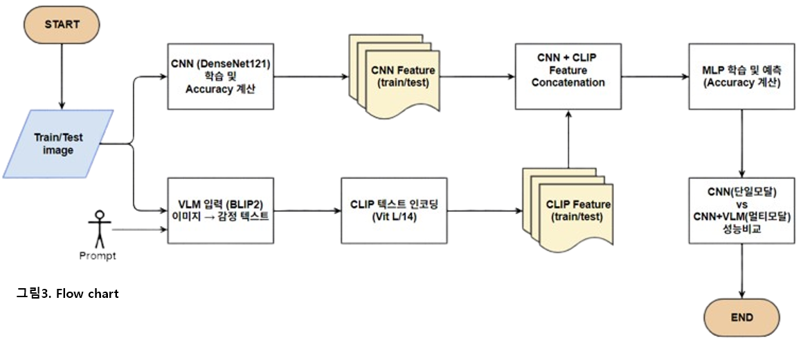 

▲ 전체 시스템의 흐름도입니다. CNN은 이미지에서 feature를 추출하고, BLIP2는 해당 이미지에 대한 감정 설명 문장을 생성합니다. 생성된 텍스트는 CLIP을 통해 벡터로 임베딩되며, 이미지 feature와 결합하여 MLP로 감정을 분류합니다.

---

### Vision-Language 구조

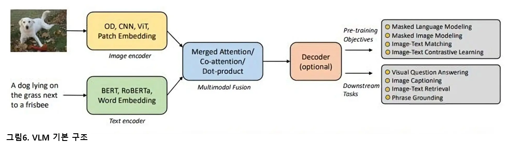
출처: Bordes, Florian, et al. "An introduction to vision-language modeling." arXiv preprint arXiv:2405.17247 (2024).

▲ Vision-Language Model(VLM)은 이미지와 텍스트를 함께 이해하는 모델로, 멀티모달 정보를 조합해 고차원적 의미를 도출합니다.

---

### 텍스트 생성 - BLIP2

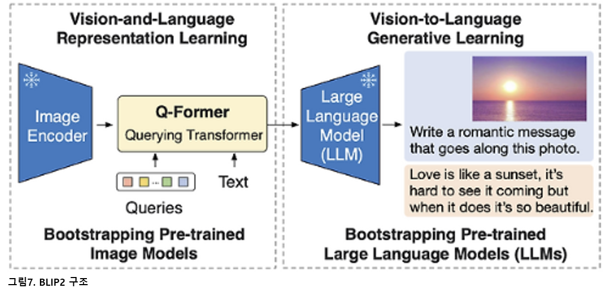
출처: Bai, Jinze, et al. "Qwen technical report." arXiv preprint arXiv:2309.16609 (2023).

▲ BLIP2는 이미지 인코더와 언어 모델을 연결해 이미지에 대한 자연어 설명을 생성하는 구조입니다.

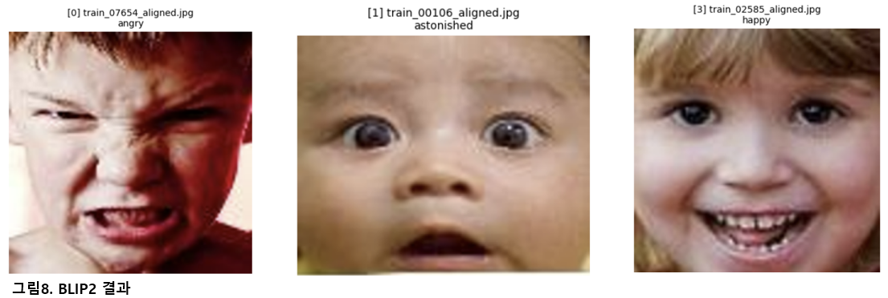  
▲ 실제로 BLIP2가 생성한 감정 설명 문장 예시입니다. 이 문장들은 감정 분류의 보조 정보로 사용됩니다.

---

### 텍스트 임베딩 - CLIP

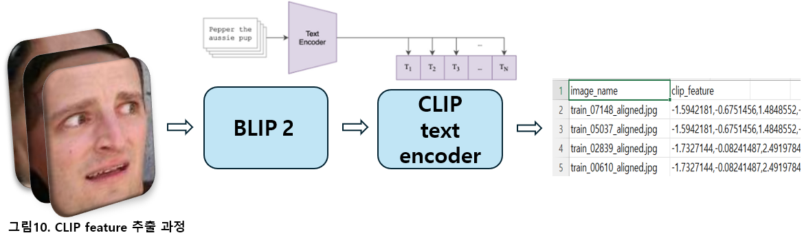  
▲ CLIP은 텍스트를 고차원 벡터로 임베딩하는 역할을 하며, 생성된 문장을 수치화하여 CNN 이미지 feature와 결합합니다.

---

### 이미지 Feature + 텍스트 Feature 결합

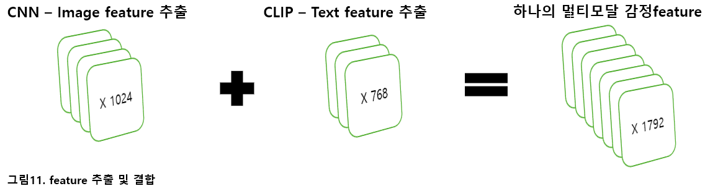  
▲ 이미지 feature(1024차원)와 텍스트 feature(768차원)를 concat하여 1792차원의 멀티모달 feature를 생성합니다.

---

## 데이터셋 (RAF-DB)

### 감정 클래스 예시

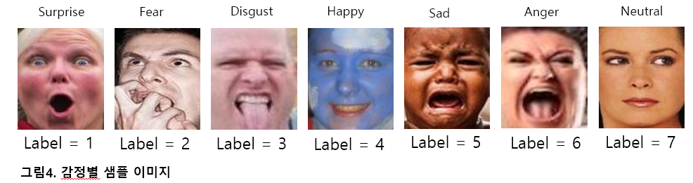  
▲ 각 감정 클래스에 해당하는 이미지 샘플들입니다. 총 7개의 감정 클래스를 포함합니다.

### 클래스 분포

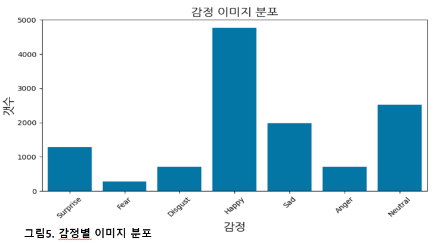  
▲ 감정 클래스별 데이터 수 분포입니다. 'Happy' 클래스가 매우 많고, 'Fear' 클래스는 매우 적은 불균형 문제가 있습니다.

| 구분 | 개수 |
|------|------|
| Train | 9,816장 |
| Validation | 982장 |
| Test | 1,533장 |

▲ 전체 데이터셋을 학습/검증/테스트 세트로 나눈 분포입니다.

---

## 모델 구성 및 실험 결과

### CNN 구조 및 성능 비교

| 모델 | Test Accuracy | 비고 |
|------|----------------|------|
| VGG16 | 66.8% | Early stopping(16) |
| ResNet18 | 74.6% | Early stopping(12) |
| DenseNet121 | **76.9%** | Early stopping(17) |

▲ 서로 다른 CNN 모델의 성능 비교입니다. DenseNet121이 가장 높은 정확도를 보였습니다.

---

### Augmentation 실험 결과

| 기법 | Test Accuracy | 비고 |
|------|----------------|------|
| Original | 73.4% |  |
| Flip | 74.6% | 가장 성능 우수 |
| Rotate | 72.7% |  |
| Crop | 57.7% | 성능 저하 발생 |

▲ 데이터 증강 기법별 성능입니다. Flip이 가장 효과적이었으며, Crop은 정보 손실로 인해 성능이 하락했습니다.

---

## MLP 분류기 + Attention 도입

### MLP 구조 및 코드 설명

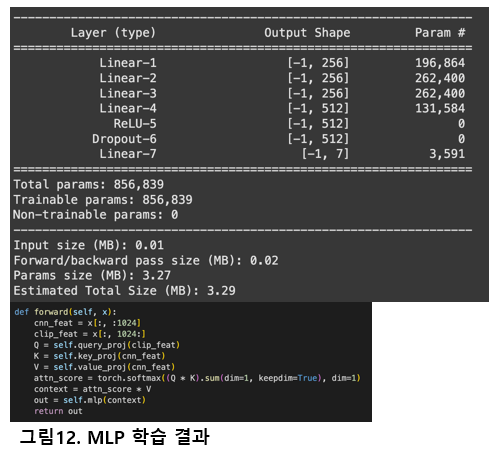  
▲ 멀티모달 feature를 입력으로 받는 MLP 분류기 구조입니다. Attention을 활용해 중요한 정보를 강조합니다.

### 학습 곡선

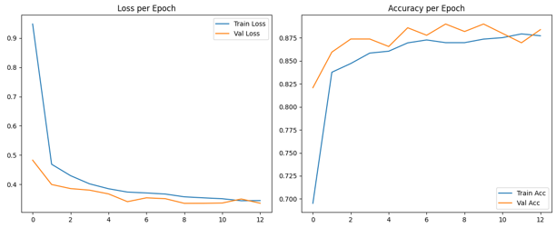  
▲ MLP 학습 과정에서의 Loss 및 Accuracy 곡선입니다. 성능이 안정적으로 수렴하고 있는 모습을 보여줍니다.

### 모델 성능 비교

| MLP 구조 | Accuracy | 향상률 |
|----------|----------|--------|
| CNN 단일모델 | 76.9% | - |
| MLP + Attention | **82.2%** | +7.3% |
| MLP + Self-Attention | 81.4% | +5.8% |
| MLP + Cross-Attention | 80.8% | +5.3% |

▲ Attention을 도입함으로써 모든 구조에서 성능 향상이 확인되었습니다.

---

## 클래스별 성능 분석

| Class | CNN 단일모델 | 멀티모달 구조 | 향상률 |
|--------|----------------|----------------|--------|
| Surprise | 0.7548 | 0.7976 | +5% |
| Fear | 0.4324 | 0.5846 | +35% |
| Disgust | 0.5176 | 0.5521 | +6% |
| Happy | 0.9012 | 0.9184 | +1.9% |
| Sad | 0.7326 | 0.7930 | +8% |
| Angry | 0.6418 | 0.7284 | +13% |
| Neutral | 0.6864 | 0.8000 | +16% |

▲ 감정 클래스별 성능 향상률입니다. 특히 'Fear'과 'Neutral' 클래스에서 멀티모달 구조의 성능 향상이 두드러졌습니다.

---

## 최종 모델 성능 비교 요약

| 모델        | Test acc | CNN 단일 모델 대비 향상률 |
|-------------|----------|-----------------------------|
| CNN         | 0.7697   | -                           |
| **CNN + VLM** | **0.8226** | **7.3% 상승** 🔺            |

▲ 멀티모달 구조(CNN + VLM)를 사용했을 때 CNN 단일 구조 대비 7.3% 정확도 향상이 확인되었습니다.

---

## 문제점 및 개선 사항

### 1. 학습 곡선 분석

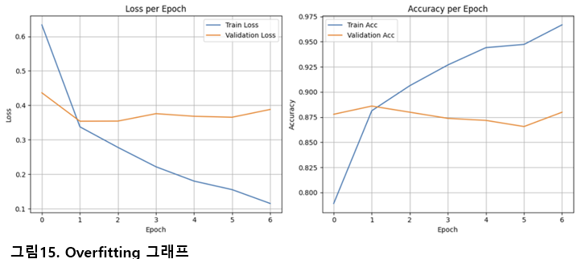  
▲ 모델 학습 곡선입니다. 일부 모델은 Early Stopping 이후 과적합 양상을 보이며, regularization 필요성이 제기됩니다.

---

### 2. Prompt 품질 문제

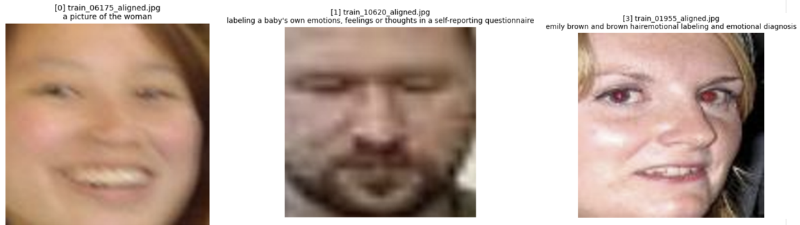  
▲ BLIP2가 생성한 문장이 부정확하거나 맥락에 맞지 않아 성능 저하 요인이 되기도 합니다.

---

### 3. 클래스 불균형

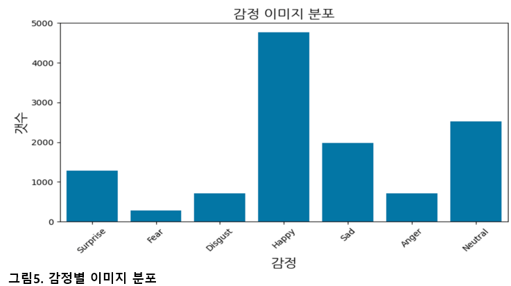  
▲ 데이터가 한쪽 감정(Happy)에 치우쳐 분포돼 있어, 소수 클래스 예측 정확도에 한계가 있습니다.

---

### 4. Augmentation 실험 일관성 부족

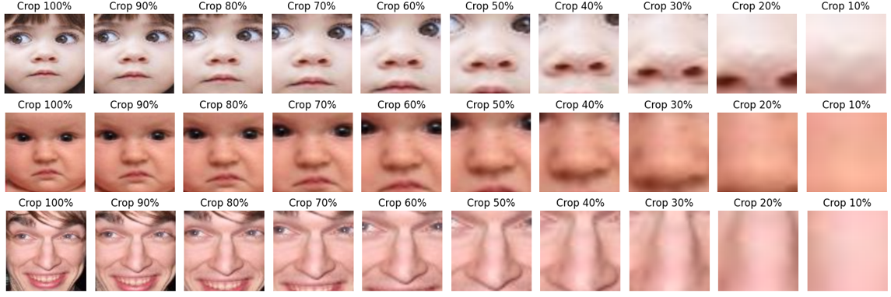  
▲ Crop 비율이 과도할 경우 감정 인식에 필요한 얼굴 특징이 손실되어 성능 하락으로 이어졌습니다.

---

## 결론

- VLM 기반 멀티모달 구조는 CNN 단일 모델보다 감정 분류에서 우수한 성능을 보였습니다.  
- 텍스트 설명은 복합적인 감정이나 모호한 표정에서 분류 정확도를 높이는 데 기여했습니다.  
- Attention 기반 MLP 구조는 다양한 feature 간의 중요도를 반영해 효과적인 분류를 가능하게 했습니다.

---

## 웹 구현 - Flask 기반 감정 분석 플랫폼

본 프로젝트는 학습된 모델을 웹에서 활용할 수 있도록 Flask 프레임워크를 기반으로 간단한 감정 분석 웹 앱을 구현하였습니다.

### 주요 기능

- 사용자 로그인 / 회원가입
- 이미지 업로드 후 감정 분석 결과 출력
- 분석 결과에 따라 랜덤 코멘트 제공
- 분석 기록 저장 및 대시보드에서 확인 가능
- Flask-Admin을 통한 관리자 페이지 제공

### 전체 웹앱 구조 개요

- `app.py`: 전체 플로우 제어 (라우팅, 모델 호출 등)
- `templates/`: HTML 템플릿 파일들 (`login.html`, `register.html`, `result.html` 등)
- `models.py`: SQLAlchemy 기반 감정 기록 DB 모델 정의
- `emotion.db`: 결과 저장용 SQLite 데이터베이스

> Flask 서버는 ngrok을 통해 외부에서도 접속 가능하게 구성

## Flask 시연

---

---
